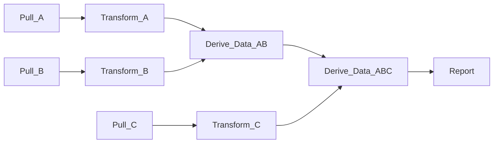

DaggyR
==

Description
==

DaggyR is a work orchestration framework for running workflows modeled as
directed, acyclic graphs (DAGs). These are quite useful for all kinds of
work flows, especially Fetch, Extract, Transform, Load (FETL) workloads.

Below is an example workflow where data are pulled from three sources
(A, B, C), some work is done on them, and a report is generated.

Each step depends on the success of its upstream dependencies, e.g.
`Derive_Data_AB` can't run until `Transform_A` and `Transform_B` have
completed successfully.



Individual tasks (vertices) are queued as soon as their upstream tasks have
completed successfully, and run via a task executor back end as soon as
that back end has capacity.

Daggy supports multiple executor back ends, from local executor (via fork),
to distributed work managers like [slurm](https://slurm.schedmd.com/overview.html)
, SSH (planned), Remote agent (planned), or [kubernetes](https://kubernetes.io/) (planned).

Run state is maintained via state trackers. Currently daggy supports an
in-memory state manager. Future plans include supporting SQL
[postgres](https://postgresql.org).

Running the Server
===

```bash

# The default executor
DAGGYR_EXECUTOR="local"

# Local executor options
DAGGYR_LOCAL_EXECUTOR_WORKERS=10

# Slurm executor options
DAGGYR_SLURM_EXECUTOR_BASE_URL="https://...."

#
# Trackers
#
DAGGYR_TRACKER="memory" # one of postgres, mysql,
```
