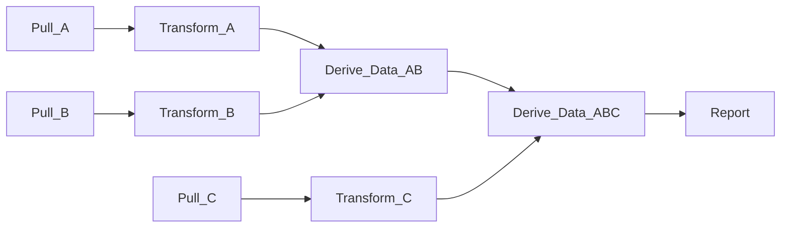

DaggyR

Description
==

DaggyR is a work orchestration framework for running workflows modeled as directed, acyclic graphs (DAGs). These are
quite useful when modeling data ingestion / processing pipelines.

Below is an example workflow where data are pulled from three sources (A, B, C), some work is done on them, and a report
is generated.

Each step depends on the success of its upstream dependencies, e.g. `Derive_Data_AB` can't run until `Transform_A` and
`Transform_B` have completed successfully.

Individual tasks (vertices) are run via a task executor. Daggy supports multiple executors, from local executor (via
fork), to distributed work managers like [slurm](https://slurm.schedmd.com/overview.html).

State is maintained via state loggers. Currently daggy supports an in-memory state manager.

Future plans include supporting [postgres](https://postgresql.org).
