DaggyR
======

DaggyR is a work orchestration framework for running workflows modeled as
directed, acyclic graphs (DAGs). These are quite useful for all kinds of
work flows, especially Fetch, Extract, Transform, Load (ETL) workloads.

Features
========

- **Scalability** - Runs can scale to millions of tasks with dependencies
- **Resuming Runs** - Runs can be edited and re-queued, picking up where it left off
- **Task Generators** - Tasks can generate other tasks
- **Parameterized Tasks** - Tasks can be expanded using a flexible templating approach.
- **Simplicity** - DaggyR is simple to get started using without any extra infrastructure
- **Flexibility** - Flexible state tracking and execution back ends

DaggyR is written entirely in async Rust, to scale and run workloads as
quickly as possible.

Why Another Engine
==================

There are [many](https://airflow.apache.org/), [many](https://luigi.readthedocs.io/en/stable/index.html),
[many](https://azkaban.github.io/), [many](https://prefect.io), [many](https://www.dagster.io/) variations
of DAG work orchestration frameworks out there, so why create another one?

One Tool to do One Thing Well
-----------------------------

DaggyR follows the UNIX philosophy of building small tools that perform a single
task well. DaggyR runs task DAGs, leaving out things like scheduling or fancy
visualizations to other tools.

Simplicity
----------

Just running `cargo run --bin server` gives you everything you need to get
started running DAGs. No need for a separate database, a pub/sub system,
remote agents, a Java runtime, or anything else. Fast to stand up, and
fast to iterate on.

Scalability
-----------

Scalability is at the heart of DaggyR. Runs can scale to millions of individual
tasks.

Runs can scale to millions of tasks and dependencies without falling over.
Runs can be edited and re-run, picking up where it left off.

Flexibility
-----------

Tasks can be executed on a variety of backends to best take advantage of your
environment, and adding additional executors is fairly easy.


Overview
========

Below is an example workflow where data are pulled from three sources
(A, B, C), some work is done on them, and a report is generated.

Each step will only run once its upstream dependencies have completed
successfully, e.g.  `Derive_Data_AB` can't run until `Transform_A` and
`Transform_B` have completed successfully.

```mermaid
graph LR
  Pull_A-->Transform_A;
  Pull_B-->Transform_B;
  Pull_C-->Transform_C;

  Transform_A-->Derive_Data_AB;
  Transform_B-->Derive_Data_AB;
  Derive_Data_AB-->Derive_Data_ABC;
  Transform_C-->Derive_Data_ABC;

  Derive_Data_ABC-->Report;
```



Individual tasks (vertices) are queued as soon as their upstream tasks have
completed successfully, and run via a task executor back end as soon as
that back end has capacity.

Run Specifications
------------------

A run specification includes three parts:

1. Tags
  - Tags are `key: value` arbitrary pairs.
  - Keys and values must be strings
  - They can be used to annotate and search for runs
1. Tasks
  - Tasks define a unit of work, and its relationship to other tasks.
  - Tasks can be templated, and expanded using `parameters` while maintaining dependencies.
1. Parameters
  - Parameters are `key: [value]` pairs that are used to expand task templates.

Here is an example of a full specification:

```json
{
  "tags": {
    "env": "test"
  },
  "parameters": {
    "{{VAR}}": [ "value1", "value2", ... ]
  },
  "tasks": [
    {
      "class": "producer",
      "details": { ... },
    },
    {
      "class": "echoer",
      "details": { ... },
      "parents": [
        "echoer"
      ]
    },
  ]
```

Tasks
-----


Executors
---------

DaggyR relies on back-end executors to actually run tasks.

- Local executor (via fork)
- [Slurm](https://slurm.schedmd.com/overview.html)
- SSH (run tasks on SSH remotes)
- Remote agent -- An agent you can run on a host and submit jobs to
- [kubernetes](https://kubernetes.io/) (planned)

Trackers
--------

Run state is maintained via trackers. Currently daggy supports an
in-memory state manager. Future plans include supporting SQL
[postgres](https://postgresql.org).

Running the Server
==================

```bash
# By default will use a memory tracker and local executor with
# min(1, # of cores -2) workers / task parallelism
cargo run --bin server
```

More detailed configurations and exmaples are in the `examples` directory.
