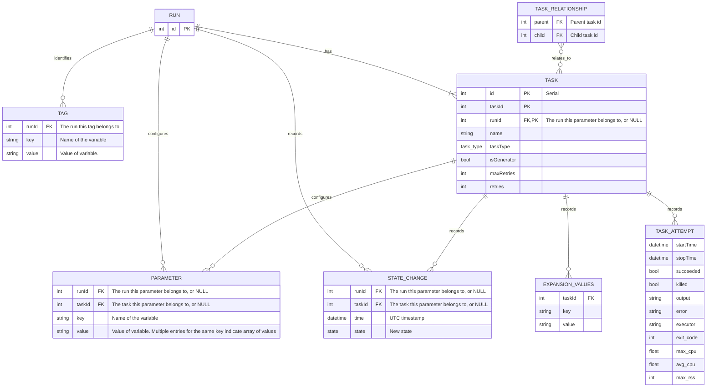

```mermaid
erDiagram
	RUN ||--o{ TAG : identifies
	RUN {
		int id PK
	}
	TAG {
		int runId FK "The run this tag belongs to"
		string key "Name of the variable"
		string value "Value of variable."
	}
	RUN ||--o{ PARAMETER : configures
	PARAMETER {
		int runId	FK "The run this parameter belongs to, or NULL"
		int taskId FK "The task this parameter belongs to, or NULL"
		string key "Name of the variable"
		string value "Value of variable. Multiple entries for the same key indicate array of values"
	}
	RUN ||--o{ STATE_CHANGE : records
	STATE_CHANGE {
		int runId	FK "The run this parameter belongs to, or NULL"
		int taskId FK "The task this parameter belongs to, or NULL"
		datetime time "UTC timestamp"
		state state "New state"
	}
	RUN ||--|{ TASK : has
	TASK {
		int id PK "Serial"
		int taskId PK
		int runId	FK,PK "The run this parameter belongs to, or NULL"
		string name
		task_type taskType
		bool isGenerator
		int maxRetries
		int retries
	}
	TASK_RELATIONSHIP }o--o{ TASK : relates_to
	TASK_RELATIONSHIP {
		int parent	FK "Parent task id"
		int child	FK "Child task id"
	}
	TASK ||--o{ PARAMETER : configures
	TASK ||--o{ STATE_CHANGE : records
	TASK ||--o{ EXPANSION_VALUES : records
	EXPANSION_VALUES {
		int taskId FK
		string key
		string value
	}
	TASK ||--o{ TASK_ATTEMPT : records
	TASK_ATTEMPT {
		datetime startTime
		datetime stopTime
		bool succeeded
		bool killed
		string output
		string error
		string executor
		int exit_code
		float max_cpu
		float avg_cpu
		int max_rss
	}
```
